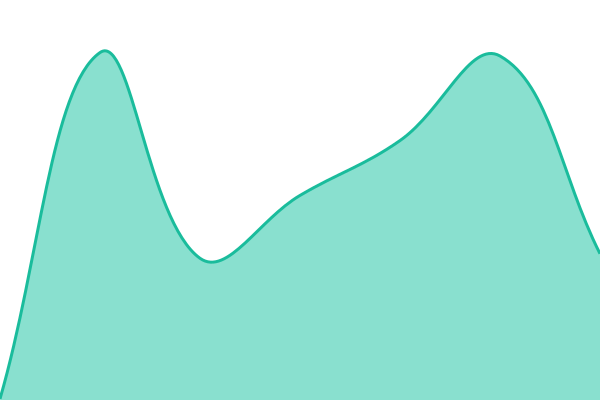

# PaceStreak Status

**Uptime monitoring and public status page for [pacestreak.com](https://www.pacestreak.com).**

Powered by [Upptime](https://upptime.js.org) — GitHub Actions, Issues and Pages. 
No servers, no third-party monitoring service, no bill.

[**status.pacestreak.com&nbsp;&rarr;**](https://status.pacestreak.com)

---

<!-- The table below is generated by Summary CI. These comments sit OUTSIDE the
     markers, so they survive regeneration. -->
<!-- markdownlint-disable MD055 MD056 -->
<!--start: status pages-->
<!-- This summary is generated by Upptime (https://github.com/upptime/upptime) -->
<!-- Do not edit this manually, your changes will be overwritten -->
<!-- prettier-ignore -->
| URL | Status | History | Response Time | Uptime |
| --- | ------ | ------- | ------------- | ------ |
|  [www.pacestreak.com](https://www.pacestreak.com) | 🟩 Up | [www-pacestreak-com.yml](https://github.com/PaceStreak/status/commits/HEAD/history/www-pacestreak-com.yml) | 

 220ms
     
 | 

<a href="https://status.pacestreak.com/history/www-pacestreak-com">100.00%</a>
    

|  [pacestreak.com](https://pacestreak.com) | 🟩 Up | [pacestreak-com.yml](https://github.com/PaceStreak/status/commits/HEAD/history/pacestreak-com.yml) | 

 250ms
     
 | 

<a href="https://status.pacestreak.com/history/pacestreak-com">100.00%</a>
    

|  [www.pacestreak.com TLS certificate](www.pacestreak.com) | 🟩 Up | [www-pacestreak-com-tls.yml](https://github.com/PaceStreak/status/commits/HEAD/history/www-pacestreak-com-tls.yml) | 

 0ms
     
 | 

<a href="https://status.pacestreak.com/history/www-pacestreak-com-tls">100.00%</a>
    

|  [pacestreak.com TLS certificate](pacestreak.com) | 🟩 Up | [pacestreak-com-tls.yml](https://github.com/PaceStreak/status/commits/HEAD/history/pacestreak-com-tls.yml) | 

 0ms
     
 | 

<a href="https://status.pacestreak.com/history/pacestreak-com-tls">100.00%</a>
    

<!--end: status pages-->
<!-- markdownlint-enable MD055 MD056 -->

## What is monitored

| Monitor                  | Why                                                                                                                                               |
| ------------------------ | ------------------------------------------------------------------------------------------------------------------------------------------------- |
| `www.pacestreak.com`     | The canonical hostname. Asserts a 200 **and** that "PaceStreak" appears in the body — a healthy status code alone is not proof the page rendered. |
| `pacestreak.com`         | The apex. Redirects are followed, so this asserts the whole chain: DNS, certificate, the Cloudflare redirect rule, and the destination rendering. |
| `www.pacestreak.com` TLS | Certificate expiry.                                                                                                                               |
| `pacestreak.com` TLS     | Certificate expiry — **a separate certificate**, see below.                                                                                       |

### Why two certificate checks

Cloudflare Pages issues a **separate certificate per custom domain**. Verified
2026-08-28: the apex certificate's SAN list is `[pacestreak.com]` and www's is
`[www.pacestreak.com]`, with different `notAfter` timestamps. They are not one
certificate with two names, so a single check cannot cover both.

The apex certificate matters even though the apex only redirects — if it
expires, visitors get a browser interstitial _before_ the redirect ever runs.

## Configuration

Everything is driven by [`.upptimerc.yml`](./.upptimerc.yml). The files in
`.github/workflows` are **generated** from it and must not be edited by hand;
they are regenerated whenever the Upptime template updates.

Pin `slug` on every monitor. Without it the slug is derived from `name`, so
renaming a monitor silently orphans its recorded history and the old data gets
pruned.

## Alerting

Notifications are configured entirely through **repository secrets**
(Settings → Secrets and variables → Actions), never in the config file. The
`secrets:` allowlist in `.upptimerc.yml` controls which are exposed to the
workflow — a secret not on that list is invisible to Upptime even if it exists.

Email over SMTP needs `NOTIFICATION_EMAIL_SMTP` set as an on switch; supplying
only the credentials is a silent no-op.

## Relationship to status.rajpoot.dev

These same endpoints are also monitored on
[status.rajpoot.dev](https://status.rajpoot.dev), which is the owner's private
all-projects view. This repository is the public, PaceStreak-only page. Both are
just GitHub Actions, so running both costs nothing.

## License

- Code: [MIT](./LICENSE) © [Anand Chowdhary](https://anandchowdhary.com)
- Data in `./history`: [Open Database License](https://opendatacommons.org/licenses/odbl/1-0/)
